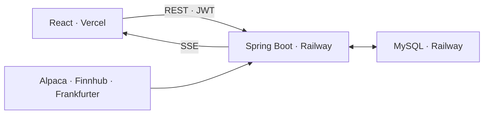

# JULens - Backend Server

> 미국 주식의 가격·거래량·뉴스를 한곳에서 확인하고 투자 의견을 나눌 수 있는 서비스의 백엔드 서버입니다.

JULens는 프리마켓, 정규장, Overnight 등 서로 다른 시간대의 미국 주식 데이터를 수집해 종목 탐색과 상세 분석에 활용합니다. 이 저장소에는 REST API, JWT 인증, 주식 데이터 수집, SSE 실시간 가격 전송, 커뮤니티 기능과 데이터베이스 처리 코드가 있습니다.

- [Frontend Repository](https://github.com/jaeminbag/JULens-client)
- [Live Demo](https://ju-lens-client.vercel.app)
- [Deployed API](https://julens-server-production.up.railway.app)


## 개발 방향

이 프로젝트에서는 화면 기능을 늘리는 것보다 다음 세 가지 백엔드 문제를 직접 다루는 데 집중했습니다.

1. 외부 API 응답 시간이 DB 트랜잭션과 커넥션 점유 시간으로 이어지지 않게 분리하기
2. 가격 변화가 적은 구간과 배포 프록시 환경에서도 SSE 연결을 안정적으로 유지하기
3. 인증·권한 검사·예외 응답을 일관된 API 규격으로 제공하기

프론트엔드는 React와 Vite로 구현했으며, 백엔드 API 연동을 테스트하고 실시간 데이터를 시각화하는 용도로 배포했습니다.

## 주요 기능

| 영역 | 구현 내용 |
| --- | --- |
| 인증 | 회원가입·로그인, BCrypt 비밀번호 암호화, JWT 기반 Stateless 인증 |
| 커뮤니티 | 게시글·댓글·좋아요 CRUD, 작성자 권한 검사, 최신순·인기순 조회와 페이징 |
| 종목 탐색 | 거래량 상위 종목 분석, 이름·가격대 검색, 정렬, 관심 종목 저장 |
| 종목 상세 | 현재가, 기간별 가격 이력, 거래량, 뉴스, Lens 분석 결과 제공 |
| 실시간 가격 | IEX WebSocket·Overnight 가격 수집, 최신가 캐싱, SSE 전송 |
| 외부 데이터 | Alpaca, Finnhub, Frankfurter 환율 API 연동 |

## 시스템 구조



### 요청 처리 흐름

```text
HTTP 요청 → Controller → Service → Repository → MySQL
```

- Controller는 요청값 검증과 공통 응답 생성을 담당합니다.
- Service는 인증, 권한 검사와 도메인 흐름을 처리합니다.
- Repository는 JPA를 통해 데이터를 조회하고 저장합니다.
- 외부 API 호출과 DB 작업은 같은 트랜잭션에 묶이지 않도록 경계를 분리했습니다.

### 실시간 가격 흐름

```text
IEX WebSocket / Overnight Quote
        ↓
CompositeRealtimeStockPriceFeed
        ↓
RealtimeStockPriceService (최신가 캐싱·구독 관리)
        ↓
StockController (SSE)
        ↓
React EventSource
```

## 핵심 문제 해결

### 1. 외부 API 호출 중 HikariCP 커넥션 풀 고갈

#### 문제

```text
HikariPool-1 - Connection is not available, request timed out after 30003ms
(total=10, active=10, idle=0, waiting=1)
```

초기 분석 흐름에서는 Alpaca와 뉴스 API 응답을 기다리는 동안 트랜잭션이 유지됐습니다. 네트워크 요청이 30초 이상 지연되면 DB 작업을 하지 않는 시간에도 HikariCP 커넥션을 계속 점유했고, 동시에 요청이 쌓이면 커넥션 풀을 사용할 수 없었습니다.

#### 원인

`@Transactional`은 메서드가 끝날 때까지 영속성 컨텍스트와 DB 커넥션을 유지할 수 있습니다. 외부 네트워크 I/O와 DB I/O가 한 메서드에 섞여 있어 네트워크 지연이 그대로 커넥션 점유 시간으로 이어졌습니다.

#### 해결

- `LensAnalysisService.runAnalysis()`를 `NOT_SUPPORTED`로 실행해 외부 API 호출 구간에서 트랜잭션을 사용하지 않도록 했습니다.
- 배치 시작·완료·실패 상태와 분석 결과 저장은 `LensAnalysisPersistenceService`로 분리했습니다.
- DB를 읽고 쓰는 메서드에만 `REQUIRES_NEW`를 적용해 짧은 단위로 커밋되도록 했습니다.
- 운영 프로필에서 OSIV를 비활성화하고 HikariCP 누수 감지 기준을 설정했습니다.

```java
@Transactional(propagation = Propagation.NOT_SUPPORTED)
public synchronized void runAnalysis(MarketSession marketSession) {
    LensAnalysisBatch batch = persistenceService.startBatch(marketSession);
    // 외부 API 조회와 분석은 트랜잭션 밖에서 실행
    persistenceService.completeBatch(batch.getId(), candidates);
}

@Transactional(propagation = Propagation.REQUIRES_NEW)
public void completeBatch(Long batchId, List<LensAnalysisCandidate> candidates) {
    // 분석 결과와 뉴스 저장
}
```

외부 API의 응답 시간이 길어져도 그 시간만큼 DB 커넥션을 점유하지 않도록 네트워크 작업과 영속화 작업의 경계를 분리했습니다.

관련 코드:

- [`LensAnalysisService`](src/main/java/com/julensserver/service/LensAnalysisService.java)
- [`LensAnalysisPersistenceService`](src/main/java/com/julensserver/service/LensAnalysisPersistenceService.java)
- [`application-real.properties`](src/main/resources/application-real.properties)

### 2. SSE 연결 유지와 첫 가격 수신 지연

#### 문제

주식 체결이 없는 구간에는 서버가 보낼 가격 이벤트도 없습니다. 이 상태가 길어지면 배포 환경의 프록시가 유휴 연결을 종료할 수 있고, 새 구독자는 다음 체결이 발생할 때까지 가격을 받지 못했습니다.

#### 해결

- 연결 직후 `ready` 이벤트와 서버가 캐싱한 최신 가격을 먼저 전송했습니다.
- 15초마다 SSE comment 형식의 `keep-alive` heartbeat를 전송했습니다.
- `Cache-Control: no-cache, no-store`와 `X-Accel-Buffering: no` 헤더로 캐시와 프록시 버퍼링을 방지했습니다.
- 완료·타임아웃·오류 콜백에서 종목 구독과 heartbeat 작업을 함께 정리했습니다.
- 스트림이 지연될 때 사용할 `/stocks/realtime/latest` 보조 조회 API를 제공했습니다.
- 프론트엔드는 EventSource 자동 재연결과 5초 주기의 보조 조회를 함께 사용합니다.

보조 조회는 임의 가격을 만들지 않고, 서버가 IEX 또는 Overnight 피드에서 실제로 받은 마지막 가격만 반환합니다.

관련 코드:

- [`StockController`](src/main/java/com/julensserver/controller/StockController.java)
- [`RealtimeStockPriceService`](src/main/java/com/julensserver/service/RealtimeStockPriceService.java)
- [`CompositeRealtimeStockPriceFeed`](src/main/java/com/julensserver/service/CompositeRealtimeStockPriceFeed.java)

### 3. 일관된 API 응답과 인증·권한 처리

성공 응답은 `ApiResponse<T>`, 실패 응답은 `ErrorResponse`로 구분했습니다. 프론트엔드는 기능마다 다른 JSON 구조를 별도로 처리하지 않고 `success`, `message`, `data` 또는 `code`, `errors`를 기준으로 응답을 처리할 수 있습니다.

```json
{
  "success": true,
  "message": "종목 조회에 성공했습니다.",
  "data": {}
}
```

```json
{
  "success": false,
  "status": 400,
  "code": "INVALID_INPUT_VALUE",
  "message": "잘못된 입력값입니다.",
  "errors": {
    "email": "이메일 형식이어야 합니다."
  }
}
```

- `GlobalExceptionHandler`가 비즈니스 예외, DTO 검증 실패와 예상하지 못한 예외를 공통 형식으로 변환합니다.
- JWT 필터가 `Authorization: Bearer <token>`을 검증하고 사용자 ID를 SecurityContext에 저장합니다.
- 게시글과 댓글 수정·삭제 시 로그인 사용자와 작성자를 비교합니다.
- 공개 조회 API와 인증이 필요한 변경 API를 `SecurityFilterChain`에서 구분했습니다.
- SSE 클라이언트가 먼저 연결을 끊은 경우에는 이미 시작된 스트림에 JSON 오류를 다시 쓰지 않도록 별도로 처리했습니다.

관련 코드:

- [`ApiResponse`](src/main/java/com/julensserver/dto/common/ApiResponse.java)
- [`ErrorResponse`](src/main/java/com/julensserver/exception/ErrorResponse.java)
- [`GlobalExceptionHandler`](src/main/java/com/julensserver/exception/GlobalExceptionHandler.java)
- [`SecurityConfig`](src/main/java/com/julensserver/config/SecurityConfig.java)

## 주요 API

| Method | Endpoint | 설명 | 인증 |
| --- | --- | --- | --- |
| `POST` | `/auth/signup` | 회원가입 | 불필요 |
| `POST` | `/auth/login` | 로그인과 JWT 발급 | 불필요 |
| `GET` | `/lens-analyses/latest` | 최신 Lens 분석 목록 조회 | 불필요 |
| `GET` | `/stocks/{ticker}/detail` | 종목 상세 조회 | 불필요 |
| `GET` | `/stocks/price-history` | 기간별 가격 이력 조회 | 불필요 |
| `GET` | `/stocks/realtime` | 종목별 실시간 가격 SSE 구독 | 불필요 |
| `GET` | `/stocks/realtime/latest` | 서버가 보유한 최신 가격 조회 | 불필요 |
| `GET` | `/posts` | 게시글 목록 조회 | 필요 |
| `POST` | `/posts` | 게시글 작성 | 필요 |
| `PUT` | `/user-stocks/{stockId}` | 관심 종목 저장 | 필요 |

전체 API는 서버 실행 후 [Swagger UI](http://localhost:8080/swagger-ui.html)에서 확인할 수 있습니다.

## 기술 스택

| 구분 | 기술 |
| --- | --- |
| Language | Java 21 |
| Framework | Spring Boot 4.1, Spring MVC |
| Security | Spring Security, JWT, BCrypt |
| Database | MySQL, Spring Data JPA, HikariCP |
| Realtime | SSE, Alpaca IEX WebSocket |
| External API | Alpaca Market Data, Finnhub, Frankfurter |
| API Docs | Springdoc OpenAPI |
| Deployment | Railway |

## 로컬 실행

### 1. 저장소 복제

```bash
git clone https://github.com/jaeminbag/JULens-server.git
cd JULens-server
```

### 2. MySQL과 환경변수 설정

기본 실행에는 `julens_db` 데이터베이스가 필요합니다. 환경변수를 설정하지 않으면 `localhost:3306`의 MySQL에 `julens` 계정으로 접속합니다.

| 환경변수 | 설명 | 기본값 |
| --- | --- | --- |
| `DB_URL` | MySQL JDBC URL | `jdbc:mysql://localhost:3306/julens_db...` |
| `DB_USERNAME` | DB 사용자 | `julens` |
| `DB_PASSWORD` | DB 비밀번호 | `1234` |
| `JWT_SECRET` | JWT 서명 키 | 개발용 기본값 |
| `APP_CORS_ALLOWED_ORIGINS` | 허용할 프론트엔드 Origin | `http://localhost:5173` |

기본 프로필은 mock 데이터 공급자를 사용합니다. 실제 외부 데이터를 사용하려면 `real` 프로필과 다음 값을 추가로 설정합니다.

```env
SPRING_PROFILES_ACTIVE=real
FINNHUB_API_KEY=...
ALPACA_API_KEY_ID=...
ALPACA_SECRET_KEY=...
```

### 3. 실행과 테스트

```bash
./gradlew bootRun
```

```bash
./gradlew test
```

## 데이터 범위와 한계

- 실시간 가격은 무료 Alpaca IEX 데이터를 사용하므로 미국 전체 거래소의 모든 체결을 포함하지 않습니다.
- Overnight 가격은 실시간 체결가가 아니라 참고 호가의 중간값입니다.
- 무료 실시간 피드 제한에 맞춰 서버 전체에서 동시에 구독하는 종목 수를 최대 30개로 제한합니다.
- 실제 데이터가 없는 구간에는 임의 가격을 생성하지 않습니다.
